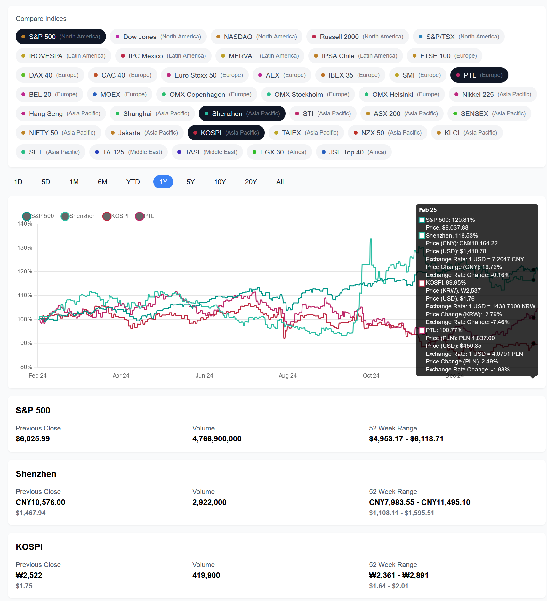

# Global Index Fund Tracker

A web application for tracking and comparing global market indices with support for multiple currencies and real-time data visualization.



## Background

Developed as a test project to learn about Cursor, motivated by understanding the performance of historical index fund investing in different countries. Took ~4h to create.

Initial setup: initialize react app with `npx create-next-app@latest`, then use Cursor's compose mode with the prompt `Help me build the Index Fund app based on the 'requirementss.md' file. The UI should be similar to the attached UI`, attaching the files in compose/ as well as a screenshot of the [Yahoo Finance UI for S&P 500](https://finance.yahoo.com/quote/%5EGSPC/).

Intermediate commands not recorded, but can see feature development in the commit history.

## Features

- **Real-time Index Tracking**: Monitor major market indices from around the world
- **Multi-Currency Support**: View indices in their local currency or converted to USD
- **Interactive Charts**: Compare multiple indices with percentage-based performance
- **Time Range Selection**: View data from 1 day to 20+ years
- **Automatic Currency Conversion**: Real-time currency conversion using FRED data
- **Efficient Data Caching**: Optimized data fetching with intelligent caching

## Getting Started

1. Clone the repository
2. Install dependencies:
   ```bash
   npm install
   ```
3. Set up environment variables:
   ```
   FRED_API_KEY=your_fred_api_key
   ```
4. Run the development server:
   ```bash
   npm run dev
   ```

## Environment Variables

- `FRED_API_KEY`: Required for currency exchange rate data from FRED

## Technical Stack

- **Frontend**: Next.js 14 with React and TypeScript
- **Styling**: Tailwind CSS
- **Data Visualization**: Chart.js with React-Chartjs-2
- **API Integration**: 
  - Yahoo Finance API for market data
  - FRED API for exchange rates

## Project Structure

```
src/
├── app/                    # Next.js app router
│   ├── api/               # API routes
│   │   ├── history/      # Market data endpoints
│   │   ├── market/       # Index listing endpoints
│   │   └── exchange-rates/# Currency conversion endpoints
│   └── page.tsx          # Main application page
├── components/            # React components
│   ├── FundSelector.tsx  # Index selection interface
│   └── IndexChart.tsx    # Chart visualization
├── services/             # Data services
│   ├── cache.ts         # Generic caching system
│   ├── data-fetcher.ts  # Market data fetching
│   ├── exchange-rates.ts # Currency conversion
│   └── market-data.ts   # Index data management
└── utils/               # Utility functions
    └── currency.ts     # Currency formatting helpers
```

## API Routes

- `/api/market`: Returns list of available market indices
- `/api/history`: Fetches historical price data for indices
- `/api/exchange-rates`: Provides currency conversion rates

## License

MIT
